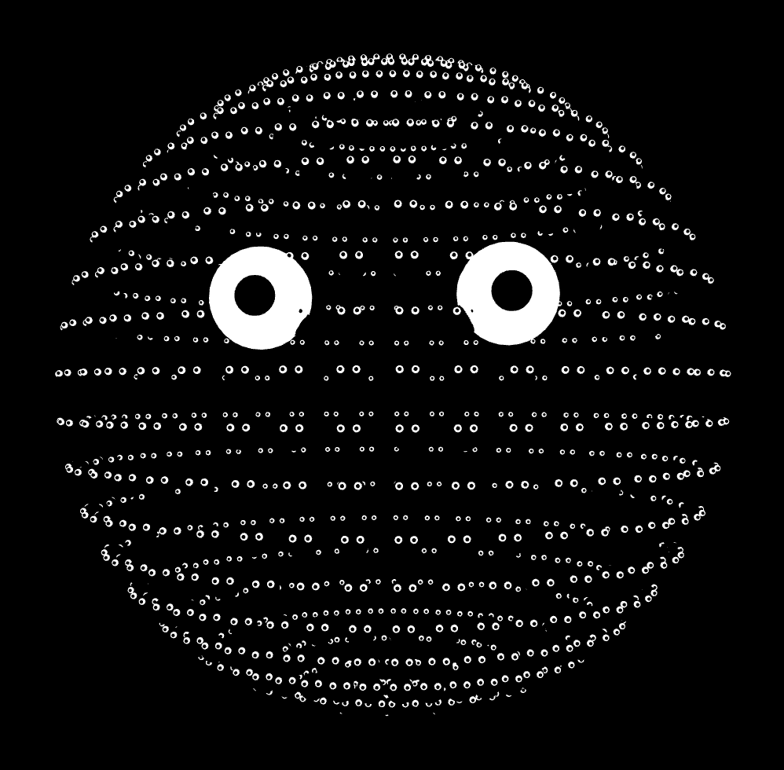
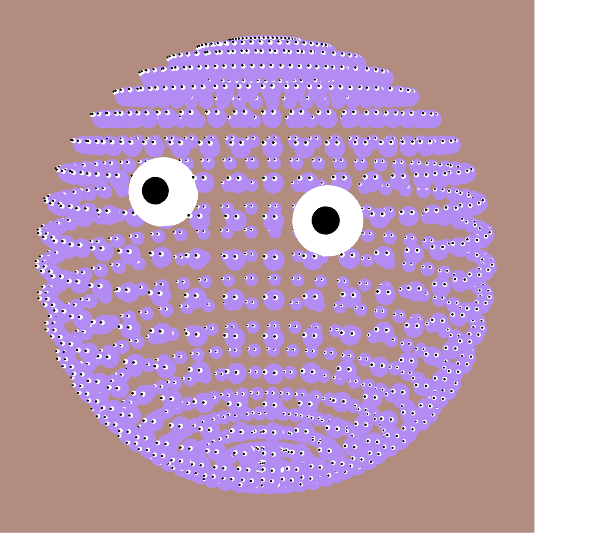

# M-Eyes Portrait

LUCAS MELDRUM

[View this project online](URL_FOR_THE_RUNNING_PROJECT)

## Description

> *M-Eyes Portrait* is a portrait art piece filled with moving eyes and faces. The user can control the color and move around the work in the 3D space to change up their experience.

> Using a mouse, the user can left click to change the color of both the background and the spheres and give the face a pulsating effect. Furthermore, the user can explore in the 3D world by using scroll wheel and dragging around the piece.

> The project is meant to be a silly portrait in a colorful world. Starting off pitch black it gives an eerie tone with the eyes following the mouse until the user clicks and enjoys the bright colors (usually). Silly, fun and interactive!

## Screenshot(s)

## Attribution

This bit should attribute any code, assets or other elements used taken from other sources. For example:

> - This project uses [p5.js](https://p5js.org). Specifically, functions that I used:
-[scale](https://p5js.org/reference/p5/scale/)
-[normalMaterial](https://p5js.org/reference/p5/scale/)
-[orbitControl](https://p5js.org/reference/p5/scale/)
-[angleMode](https://p5js.org/reference/p5/scale/)
-[translate](https://p5js.org/reference/p5/scale/)
-[map](https://p5js.org/reference/p5/scale/)
-[rotateWithFrameCount](https://p5js.org/reference/p5/scale/)

## License

This bit should include the license you want to apply to your work. For example:

> This project is licensed under a Creative Commons Attribution ([CC BY 4.0](https://creativecommons.org/licenses/by/4.0/deed.en)) license with the exception of libraries and other components with their own licenses.